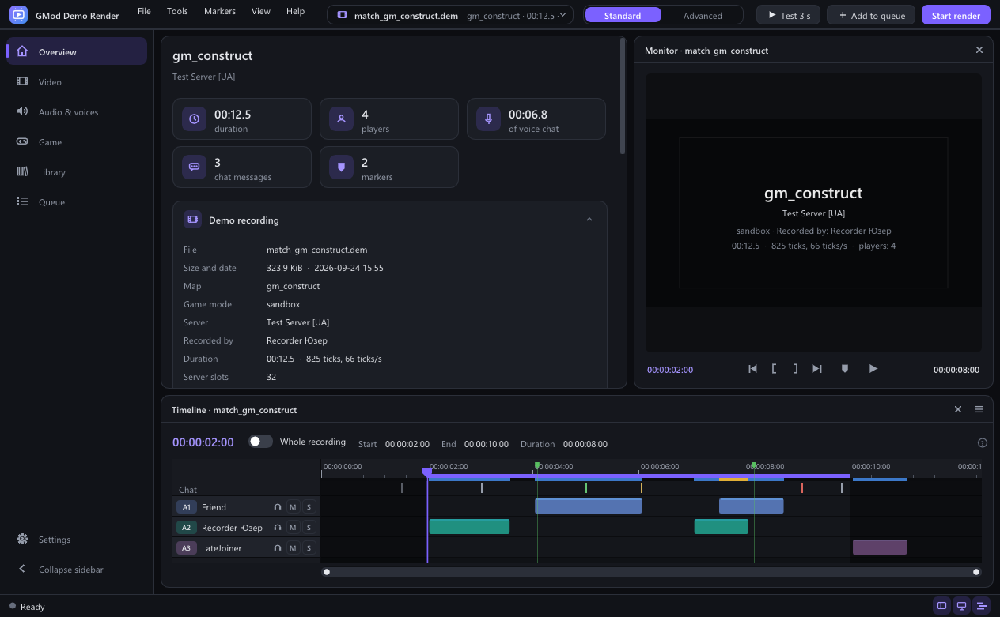

# GMod Demo Render

[](https://github.com/FosForNyak/DemoGmodRender/actions/workflows/build.yml)
[](https://github.com/FosForNyak/DemoGmodRender/releases/latest)
[](LICENSE)

Turn **Garry's Mod** demo recordings (`.dem`) into video files. Pick any resolution, frame rate,
bit depth and codec. The video carries the game audio, the players' voice chat decoded straight
from the demo and, if you want, your own microphone. Encoding runs on every CPU core or on the
GPU (NVIDIA NVENC, AMD AMF, Intel Quick Sync).



## Download

Get the latest `GModDemoRender-<version>-win64.zip` from
[Releases](https://github.com/FosForNyak/DemoGmodRender/releases/latest), unpack it anywhere and
run `gmdr.exe`. Nothing needs to be installed.

**You need:**

- Windows 10 or 11, 64-bit;
- Garry's Mod installed through Steam (the regular or the x86-64 branch), and Steam running;
- Microsoft Visual C++ 2015–2022 Redistributable (x64). Most Steam games already install it.

The interface is fully translated into English and Ukrainian. Russian, Belarusian, Polish, Czech,
German, French, Spanish, Italian, Portuguese (Brazil and Portugal), Galician, Lithuanian, Latvian,
Estonian, Finnish, Turkish, Esperanto, Hindi and Simplified Chinese are partly translated so far;
anything not yet translated is shown in English. By default the language follows Windows, and you
can switch it in **Settings → Language** or **Tools → Мова / Language**.

## Features

**Rendering**

- Any resolution (480p up to 8K, vertical formats too) and any frame rate, even fractional
  (`59.94`, `60000/1001`). The game advances by a fixed time step, so a slow PC renders 4K at
  240 fps correctly. It just takes longer.
- Real **motion blur**. The game renders N sub-frames per video frame and the program blends
  them with a configurable shutter angle. The blending keeps 16 bits of precision.
- 8/10/12-bit output, 4:2:0 / 4:2:2 / 4:4:4 chroma.
- CPU codecs: H.264, H.265, AV1 (SVT-AV1, libaom), VP9, ProRes, DNxHR, FFV1, UT Video and PNG.
  GPU codecs: H.264, HEVC and AV1 via NVENC, AMF, Quick Sync, Vulkan and Direct3D 12. At
  startup the program tests which GPU encoders actually work on your card and shows only those.
- Output formats: MP4, MKV, MOV, WebM, AVI and NUT, or PNG/TIFF/BMP/JPEG image sequences.
- One-click presets: YouTube 1080p60 and 4K60 (10-bit), ProRes 422 HQ for editing, Discord
  10/50/500 MB (the bitrate is fitted to the file size) and lossless archive.
- **Slow motion and fast forward**, ×0.25 to ×8. Slow motion is honest: the game renders
  every in-between frame, nothing is interpolated. Audio is stretched without changing pitch.
- **Several versions from one render.** The same frames are also encoded as a Discord copy
  (≤ 10 MB, 720p), a light 480p copy, a vertical 9:16 video for Shorts/TikTok/Reels and a
  ProRes master. After the render you can also get a thumbnail, a GIF and an animated WebP.
- **Parallel rendering.** Two to four game instances render parts of the fragment at the same
  time. The parts are joined without re-encoding, frame-exact.
- **Frames through a pipe where the game allows it.** The program offers `startmovie` a Windows
  named pipe instead of a file, so frames go straight into the encoder with no TGA files on disk.
  The first pipe name (`\\?\pipe\…`) did not work in the current GMod: the Source file system
  reads a name that starts with two slashes as its own `//PATHID/file` syntax. The pipe is now
  named `\??\pipe\…`, which is the same pipe written as a plain absolute path. This is not yet
  confirmed with the real game. If the game still does not write into the pipe, the program
  switches to files by itself and shows the game's console lines in the log.
- **GMod RTX** support through [RTXLauncher](https://github.com/Xenthio/RTXLauncher). The Game
  page switches between **Standard** and **RTX**, and each mode keeps its own game folder. During
  the render the program sets Remix to video-friendly settings (DLAA, no frame generation, shaders
  compiled before the frame instead of in the background, so no black frames) and restores your
  config afterwards.

**Audio and voice**

- Players' voices are decoded from the demo (Steam Voice / Opus) and placed tick-accurately.
  Pick whose voices go in, set each player's volume, mute or solo them, and preview a voice
  right in the app.
- Audio processing:
  - level every player to -18 LUFS;
  - RNNoise neural noise suppression with a gate between phrases;
  - duck the game audio under voices;
  - final loudness per EBU R128 (-14 LUFS for YouTube).
- Your own microphone from a separate recording (OBS, Audacity, Discord), with an offset.
- Subtitles: "who is speaking" `.srt`, the game chat as subtitles, and **speech recognition**.
  Voice chat becomes text locally with whisper.cpp, offline.
- "Who is speaking" labels drawn right on the video, like the in-game voice indicator.
- **Editing package**: separate 24-bit WAVs (game, each player, microphone) and an XML
  project that Premiere Pro and DaVinci Resolve import with every track and marker in place.

**Translation and dubbing**

- Recognized speech is translated into 25 languages: DeepL, Google Cloud Translation,
  LibreTranslate, or any OpenAI-compatible model, including local ones in Ollama and LM Studio.
  Translations are cached, so the same line is never paid for twice.
- Translated subtitles (`video.de.srt`) and **dubbing**: each line is read in its place, over
  the game audio, by a local engine ([OmniVoice](https://github.com/k2-fsa/OmniVoice), 600+
  languages including Ukrainian, English and Russian) or by ElevenLabs.
- **In the player's own voice**: a player's voice can be cloned from their lines in the demo,
  and a voice library collects the cleanest samples from every new demo. Cloning is off until
  you confirm the players agreed to it.
- Where the dub goes: extra audio tracks with language tags in the same video, a separate video
  per language, or separate audio files. Publishing templates set this up for YouTube
  (multi-language audio), Shorts/TikTok/Reels, Discord/Telegram and editing.

**Workflow**

- A workspace with side navigation: Overview (everything about the demo and the render
  result on one screen), Video, Audio & voices, Game, Translation & dubbing, Library, Queue and
  Settings, next to a monitor with a live preview and a timeline with a track per player,
  mute/solo, playhead and markers.
- **Standard and Advanced modes.** Standard shows only the main settings; Advanced adds every
  codec, game and audio option plus the Fragment & markers, Chat & speech and Log pages.
- Dark and light themes (or follow Windows), seven accent colors, 80–200% interface scale and
  a compact density.
- **Fragments and markers** with I / O / M, like in Premiere. Markers become chapters in
  MP4/MOV/MKV and a `.chapters.txt` with timestamps for a YouTube description.
- **Chat and events** from the demo: messages, joins and leaves (with kick/ban reasons),
  searchable and shown on the timeline. Chat addons that send text through net messages
  (e.g. `customchat`) are understood too.
- **Watch in game**: play the demo in GMod from any point in real time. In the game, F9 sets
  the fragment start, F11 the end and F6 adds a marker. The changes show up in the program
  right away.
- **Render queue**: queue demos with their own settings. The game launches only once for the
  whole queue.
- **Demo library**: every demo in the game folder and your own folders, with map, length,
  date and size, searchable and sortable.
- **Test run** ("Test 3 s"): three seconds with a step-by-step check (game started, driver
  answers, demo plays, frames and audio arrive, encoder works) and an estimate of the time and
  file size of the full render.
- Windows notifications, minimize to tray, and "then shut down / sleep" for overnight renders.

**Reliability**

- The game runs in the background, off screen and without focus, so you can keep working.
  Windows power throttling and the unfocused FPS cap are turned off for it.
- If GMod crashes or hangs, the program restarts it from the same point and keeps writing the
  same file, seamlessly.
- If the program or the PC crashes, the next start offers to finish the interrupted render.
  At most a few seconds are lost.
- MP4/MOV is written in fragments, so the file stays playable after any crash. The game pauses
  when the encoder falls behind or disk space runs low. After the render the output is verified.
- **Help → Collect a problem report** makes one ZIP with the log, settings, system info, the
  GMod console and a crash dump. Your profile path is masked, and nothing is sent anywhere.

## Quick start

1. Make sure Steam is running and Garry's Mod is closed.
2. Run `gmdr.exe` and drop a `.dem` file onto the window, or click **Open demo...**.
   Demos recorded with `record` are in `…\steamapps\common\GarrysMod\garrysmod\` or its
   `demos` subfolder. The **Library** page lists them all, and the demo name at the top of the
   window opens a list of recent demos.
3. Choose a preset, or set the resolution, FPS and codec on the **Video** page.
4. Optionally mark a fragment on the timeline: click the ruler, then press **I** and **O**.
5. Click **Test 3 s** to check every step and see how long the render will take.
6. Click **Start render**. The program finds GMod, launches it in the background and records
   the demo.

The video appears next to the demo. The **Output file** card on the Video page (and on the
Overview) shows the path: click the file name to pick another one, or the pencil to type a path.

## The window

The top bar holds the menus, the current demo (click it for recent demos), the
**Standard / Advanced** switch and the action buttons. The sidebar switches pages:

| Page | What it holds |
|---|---|
| Overview | The demo at a glance: duration, players, voice chat, messages and markers; server, protocol and warnings; the player list; what the render will produce |
| Video | Output file, preset, resolution, frame rate, motion blur, speed, codec, quality, extra versions |
| Audio & voices | Game audio, players' voices with volume and preview, voice processing, subtitles and labels, your microphone |
| Game | Standard / RTX game copy and its folder, the driver, how the game renders |
| Fragment & markers | Precise fragment times and the marker list (Advanced) |
| Chat & speech | Chat, events and recognized speech with search and filters (Advanced) |
| Library, Queue | All demos; several renders in a row |
| Settings | Theme, accent color, scale, density, language, notifications, tray, `.dem` files |

Next to the settings pages sits the **monitor**: before a render it shows the demo's map,
server, recorder and length; during a render, a live preview and the checks. Under them is the
**timeline**: a track per player with M (mute) and S (solo), a chat track, the ruler, the
playhead and markers. Drag the gutters to resize them, or hide them with the buttons at the
right of the status bar. Accent-colored values such as the resolution, speed or volume can be
dragged left and right, or clicked to type a number.

| Key | Action |
|---|---|
| **I** / **O** | Set the fragment start / end at the playhead |
| **M** | Add a marker at the playhead (or Ctrl+click the timeline) |
| **Shift+I** / **Shift+O** | Go to the fragment start / end |
| **Home** / **End** | Go to the start / end of the demo |
| **Ctrl+O** | Open a demo |
| **Ctrl+1…9** | Switch pages |
| **Ctrl+B** | Sidebar with icons only / with labels |
| **Ctrl+,** | Settings |

## How it works

A `.dem` file contains no pictures. It is a recording of the game's network packets: where
entities are, which sounds played, what players said on voice chat. Only the GMod engine, with
your maps, models, addons and Lua, can draw that correctly. So the program does not re-draw
the game; it drives it.

1. **Demo analysis.** The program parses the `HL2DEMO` format itself (protocol 24 plus
   GMod-specific messages, including GMod 2026 servers). It reads the map, length, tick rate
   and player names, and decodes the voice chat.
2. **Fixed time step.** GMod starts with `host_framerate` set to FPS × sub-frames. Every
   game frame is then exactly 1/FPS of demo time, however fast or slow the PC is.
3. **Driver in the GMod menu.** A small Lua script starts the demo and waits until it really
   plays. It turns `startmovie` on at the right tick, off at the end, and closes the game.
4. **Frame pipeline.** `startmovie` writes every frame (TGA or JPEG) as a separate file
   `name0000.tga`, `name0001.tga`... The program gives it a name among Windows named pipes
   (`\??\pipe\gmdr_…`) instead of a folder and opens a pipe for each upcoming frame number
   in advance. When the game "opens the file" for a frame, it connects to that pipe, and the
   frame lands straight in the program's memory: no frame is written to disk, and the number in
   the name keeps the order. The audio arrives the same way and is kept as a WAV. The program
   decodes the frames in parallel, blends sub-frames for motion blur, scales and converts color
   (BT.709) on all cores, and encodes with FFmpeg on its own thread. If a game build does not
   write into the pipe, the program restarts the game from the same point with frames going
   through files in a temporary folder (read and deleted right away) and remembers that.
5. **Audio.** The game audio, the decoded voices and your microphone are mixed and encoded in
   sync with the video.

The internals are described in [docs/ARCHITECTURE.md](docs/ARCHITECTURE.md) (in Ukrainian).

## Voices and your microphone

Other players' voices are stored in the demo, and the program decodes them cleanly and exactly
in time. While rendering, in-game voice is muted (`voice_scale 0`) so voices are not doubled.
**Save voices to files...** exports each player's voice for the fragment or the whole demo. All
files start at the same moment, so they line up at the start of the tracks in an editor.

**Your own voice** is not sent back to you by the server, so a normal demo does not have it.
There are two ways around that:

- type `voice_loopback 1` in the GMod console before recording the demo. Your voice ends up in
  the demo and is marked "(you)";
- or record your microphone separately and add the file under **Audio & voices → Own
  microphone**. The offset sets the second of video where the file starts; it can be negative.

## Translation and dubbing

The **Translation & dubbing** page works on top of speech recognition, so download a whisper
model on the Chat & speech page first. Then:

1. Pick the languages.
2. Pick a publishing template, or choose the outputs yourself: translated subtitles, a dub as
   tracks in this video, a separate video per language, and separate audio files.
3. Choose the translation service. DeepL gives the most natural result and has a free key
   (500,000 characters a month). For a free offline setup, run a model in
   [Ollama](https://ollama.com) (`ollama pull qwen2.5:7b`) and pick "Language model".
4. For dubbing, press **Install** under the local engine. It downloads about 5 GB (uv, Python
   3.12, PyTorch with CUDA, OmniVoice and its model) into one folder of the program and changes
   nothing else; it works much faster on an NVIDIA GPU. Or use ElevenLabs with your key.

Everything happens after the video is rendered; a failed translation or dub never breaks the
video itself. Dub tracks are titled "(AI dub)". The YouTube template also writes
`video.youtube.txt`, which says which file goes where in YouTube Studio (Languages → Dub).

**Privacy.** API keys are stored encrypted with Windows DPAPI, readable only by your Windows
account, and are removed from problem reports. With DeepL, Google or ElevenLabs, the text of
the lines is sent to that service. With ElevenLabs cloning, the voice samples are sent too.
The local engine and a local model send nothing anywhere. A voice is personal data: clone a
player's voice only if they agreed, and delete samples from the voice library at any time.

## Command line

`gmdr-cli.exe` does the same work without a window, which suits batch jobs. Its messages are in
Ukrainian by default; add `--lang en` or set `GMDR_LANG=en` for English.

```
gmdr-cli info demo.dem [--chat]
gmdr-cli render demo.dem -o video.mp4 --size 2560x1440 --fps 60 --codec hevc_nvenc --bit-depth 10
gmdr-cli render demo.dem -o film.mov --codec prores_ks --motion-blur 16 --shutter 180 --acodec pcm_s24le
gmdr-cli render demo.dem -o clip.mp4 --start 30 --end 75 --hide-hud --mic mic.wav --mic-offset -1.5
gmdr-cli render demo.dem --start 10:00 --end 11:00 --test-run
gmdr-cli render demo.dem -o discord.mp4 --start 1:00 --end 1:30 --size 1280x720 --target-size 10
gmdr-cli render demo.dem -o yt.mp4 --level-voices --denoise --duck-game --loudness -14
gmdr-cli render demo.dem -o clip.mkv --markers "5:30=Fight; 7:10=Final" --chat-srt
gmdr-cli render demo.dem -o fight.mp4 --also discord,vertical,thumb,gif
gmdr-cli render demo.dem -o slowmo.mp4 --start 2:10 --end 2:14 --speed 0.25
gmdr-cli render demo.dem -o long.mp4 --start 1:00:00 --end 1:20:00 --motion-blur 8 --parallel 2
gmdr-cli render a.dem b.dem c.dem -o videos\
gmdr-cli queue overnight.txt --then shutdown
gmdr-cli transcribe demo.dem --language en -o speech.srt
gmdr-cli render demo.dem -o yt.mp4 --translate en,de,pl --dub --publish youtube
gmdr-cli render demo.dem -o clip.mkv --translate en --dub --dub-to tracks,videos --translator openai --translator-model qwen2.5:7b
gmdr-cli translate demo.dem --translate en,es -o clip.mp4 --start 1:00 --end 2:00
gmdr-cli voice-engine install -y
gmdr-cli voices
gmdr-cli watch demo.dem --from 12:30
gmdr-cli voice demo.dem -o voices\ --start 1:00:00 --end 1:05:00
gmdr-cli resume
gmdr-cli encoders --test
gmdr-cli report -o report.zip
```

A queue file has one demo per line with its own options. Empty lines and lines starting with
`#` are skipped:

```
"C:\demos\match.dem" --start 5:00 --end 7:30 -o "D:\video\fight.mp4"
"C:\demos\match.dem" --start 12:00 --end 13:00 --hide-hud
C:\demos\other.dem --size 2560x1440
```

Service keys for the command line come from environment variables (`GMDR_DEEPL_KEY`,
`GMDR_GOOGLE_KEY`, `GMDR_LIBRE_KEY`, `GMDR_OPENAI_KEY`, `GMDR_ELEVENLABS_KEY`) or from keys saved
in the window. Voice cloning needs `--clone-voices --voices-consent`.

Run `gmdr-cli --help` for every option.

## What the program changes

- It adds `garrysmod\lua\menu\gmdr_driver.lua` and one line at the end of
  `garrysmod\lua\menu\menu.lua`. The script does nothing until the program hands it a job. A
  backup is kept as `menu.lua.gmdr_backup`. Remove it with **Tools → Remove the driver from
  GMod**, or verify the game files in Steam.
- During a render or a watch session it creates temporary files in `garrysmod\cfg\gmdr`,
  `garrysmod\data\gmdr` and `garrysmod\gmdr_tmp` (the game audio WAV; frames too, if they go
  through files). They are deleted afterwards. Frames go through named pipes
  `\\.\pipe\gmdr_…` that exist only while the render runs.
- Console variables changed for the render (`fps_max`, `mat_vsync`, `voice_scale`,
  `cl_drawhud`...) are restored. `config.cfg` is restored from a backup even if the game was
  closed mid-render.
- Garry's Mod is muted in the Windows volume mixer during the render (the video still has
  sound). Windows is kept awake until the render ends.
- The `.dem` file association is registered only if you turn on **Tools → Open .dem files with
  a double click**. It goes under `HKCU` for your account only, and the same menu item removes
  it.

The program injects nothing into the game process and does not touch anti-cheat. It uses only
standard engine features (`startmovie`, `host_framerate`, the menu Lua state), Windows named
pipes that the game writes into like into any file, and ordinary Windows window management.

Settings are saved in `gmdr_settings.json` next to the program, and the log in `gmdr_log.txt`.
If the program folder is not writable (for example `Program Files`), they go to
`%LOCALAPPDATA%\GModDemoRender` instead.

## Troubleshooting

If the cause of a problem is unclear, use **Help → Collect a problem report...** and attach the
ZIP. You can look inside before sending it.

- **"Garry's Mod is already running".** Close the game; the program launches it itself with
  the right options.
- **The game closes at once, or "the driver does not respond".** Make sure Steam is running.
  If GMod was just updated and replaced `menu.lua`, use **Tools → Install the driver into GMod**.
- **"The demo did not start".** The demo was recorded by another GMod version, or the server
  used maps or addons you don't have. Check that the demo plays in the game itself
  (`playdemo demos/name`). Joining that server once usually downloads the content.
- **A step of the test run fails.** The step shows a hint and the last lines of the game
  console.
- **The background game stops producing frames.** The program moves the window back on screen,
  behind other windows, and logs it. If it happens every time, choose **Behind other windows**
  on the Game page. Don't minimize the game: a minimized game does not draw.
- **The game menu flashes into a frame.** Demos also record the player pressing Esc. The
  program hides the menu at once, but a single frame can sometimes slip into the video.
- **The video size differs from the settings.** The game cannot open a window larger than the
  monitor; frames are then scaled to the requested size, with a warning in the log.
- **You hear sped-up audio from the speakers.** That's normal: the game plays sound at render
  pace. The audio in the video is correct.
- **Garry's Mod stays muted.** This happens if the game or the PC crashed mid-render. Unmute
  it in the Windows volume mixer, or just start the next render.
- **Low disk space.** Below 1 GiB free the game pauses until space is freed. Frames going
  through pipes take no disk space; if they go through files (Game page → **Frame transfer**,
  Advanced mode), lower **Frame queue on disk** or switch the frame format to JPEG.
- **"The game did not write a single frame into the pipe" / "GMod does not let startmovie write
  outside the game folders".** The game refused the pipe name (the log shows the lines of the
  game console about it). The render restarts the game with files by itself, and later renders
  with this game use files right away. The pipe is tried again after the game updates (or in 30
  days), or right away with `gmdr-cli render ... --frame-transport pipe`.
- **RTX: the start of the video is black, or the game freezes at the start.** Remix compiles
  its shaders the first time (without a cache it can take minutes). During the render the program
  makes Remix compile them before drawing the frame, so frames are not black; while the game is
  busy compiling (it keeps using the CPU), the program waits instead of restarting it.
- **The program crashed.** A `gmdr_crash_<date>.dmp` appears next to it. Please attach it
  together with `gmdr_log.txt` to your bug report.

## Building from source

You need **Visual Studio 2022 (17.8+) or 2026** with the *Desktop development with C++*
workload, which already includes CMake.

The simplest way is to run `build.bat`. It finds CMake, downloads the FFmpeg development
libraries into `third_party\ffmpeg` if they are missing, and builds `build\Release\gmdr.exe`
and `gmdr-cli.exe`. The FFmpeg DLLs are copied next to them.

In Visual Studio, use **File → Open → Folder...** and pick the repository. Choose the *Windows
x64 Release* configuration and the `gmdr.exe` target. If `third_party\ffmpeg` is missing, fetch
it first:

```
powershell -ExecutionPolicy Bypass -File scripts\get_ffmpeg.ps1
```

`scripts\get_whisper.ps1` puts `whisper-cli` into `third_party\whisper` for speech recognition.
The recognition model itself is downloaded by the program when you first need it.

Linux builds are for development: install `libavcodec-dev libavformat-dev libavfilter-dev
libswscale-dev libswresample-dev libglfw3-dev`, then run `cmake --preset linux-release &&
cmake --build --preset linux-release`.

**Tests:**

- Configure with `-DGMDR_BUILD_TESTS=ON`.
- Generate synthetic demos with `python tests/tools/make_test_demo.py out.dem truth.json`
  (needs `ffmpeg` with libopus), then run `gmdr-tests <folder with demos>`.
- Sanitizers: `-DGMDR_SANITIZE=address`, or `address,undefined` with GCC/Clang.
- Fuzzer: `-DGMDR_BUILD_FUZZERS=ON`.

CI builds and tests every push on Windows (MSVC, with end-to-end renders through a fake game)
and Linux (GCC, ASan/UBSan), and fuzzes the demo parser.

UI strings are Ukrainian in the source, with translations in `src/core/util/i18n/<lang>.inc`.
After adding strings, run `python scripts/i18n.py check` (English is required) and
`python scripts/i18n.py check --lang all` to see the coverage of the other languages.

```
src/core/demo/     .dem parser, GMod network messages, string tables, chat and events
src/core/voice/    Steam Voice packets, Opus decoding, voice timeline
src/core/audio/    WAV, mixer, FFmpeg filters, loudness, gate, voice preview
src/core/frames/   frame buffers, TGA/JPEG, frames through pipes, live frame sequence reader, motion blur
src/core/media/    FFmpeg video/audio encoders and muxer
src/core/game/     GMod discovery, Lua driver, process and window control, mixer mute
src/core/speech/   speech recognition via whisper.cpp
src/core/render/   encode pipeline, background jobs (analysis, render, queue, resume), subtitles
src/core/util/     logging, JSON, VDF, thread pool, i18n, crash reports, update check
src/gui/           Dear ImGui interface (Win32 + Direct3D 11; GLFW on Linux)
src/cli/           command-line version
tests/             unit tests, synthetic demo generator, fake game, fuzzer, A/V comparison
```

## License

GMod Demo Render is released under the [MIT License](LICENSE).

Third-party components:

- [Dear ImGui](https://github.com/ocornut/imgui) (MIT).
- [FFmpeg](https://ffmpeg.org). Releases ship the BtbN "gpl" build, which includes x264 and
  x265, so the FFmpeg DLLs in the release archive are covered by the GPL. Their license is
  included in the archive.
- [whisper.cpp](https://github.com/ggml-org/whisper.cpp) (MIT).
- The RNNoise model "leavened-quisling" from
  [rnnoise-models](https://github.com/GregorR/rnnoise-models). Its author states it is not
  subject to copyright; see `third_party/rnnoise-models/README.md`.

Garry's Mod is a trademark of Facepunch Studios. This project is not affiliated with Facepunch
Studios or Valve.
